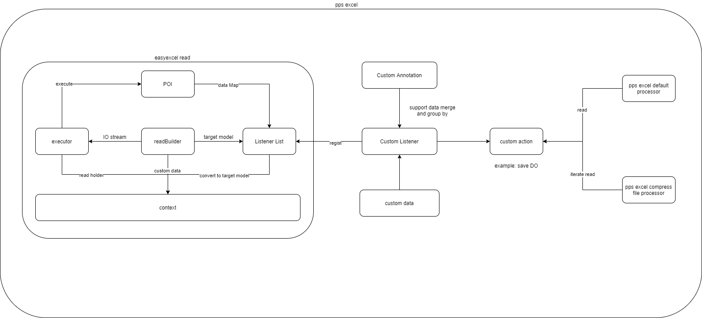
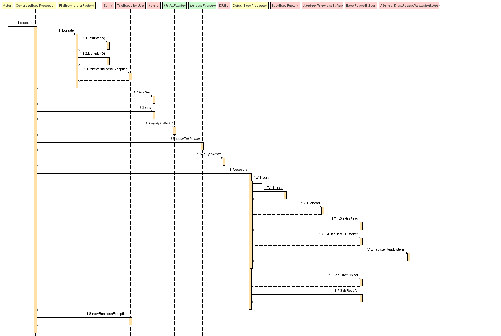
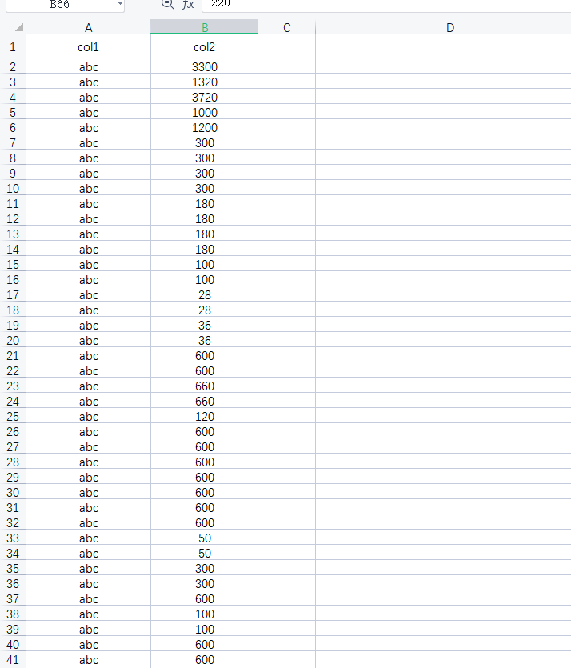
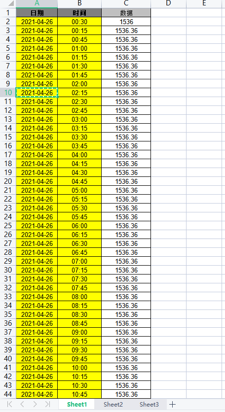
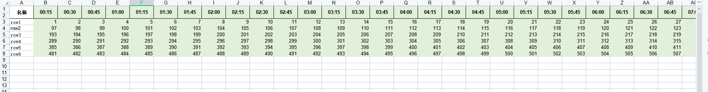
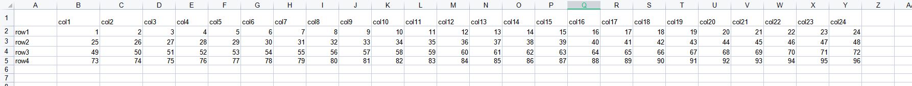
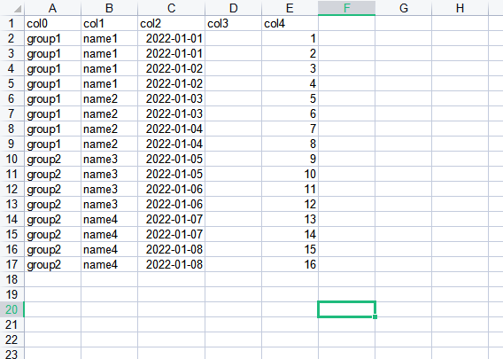
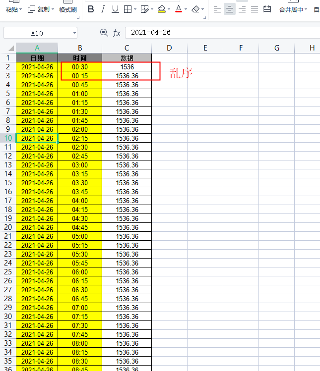
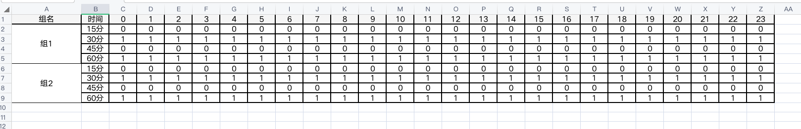

## Excel解析模块

本excel解析模块以**easyexcel为基础**，通过自定义监听器、自定义转换器、自定义excel处理器、增加io stream迭代器实现了**excel文件**以及**excel压缩包**的解析，其中支持的文件格式包括:**xls**、**xlsx**、**zip**、**rar(旧版)** ，同时还支持excel文件解析后**数据的合并、分组及排序功能**。以支持项目所需要的功能。

easyexcel地址：https://github.com/alibaba/easyexcel

### 模块结构

```java
├── pps-excel-parser                                      	// excel解析模块
│   ├── com.tsintergy.pps.excel             				
│   │	├── annotation                 						// 自定义注解，支持数据的分组及合并
│   │	├── convertor                 						// 自定义转换器，用于数据项的转换
│   │	├── enums                 							// 自定义枚举
│   │	├── io                 								// 文件io包，支持压缩包zip、rar上传
│   │	├── listener                 						// 自定义监听器，支持自定义目标模型的转换，实现数据的分组及合并
│   │	├── processor                 						// 自定义excel处理器，支持单文件xls、xlsx以及压缩包zip、rar上传
│   │	├── utils                 							// 工具包
├── ExcelProcess                                 			// 自定义excel处理器接口
├── ListenerFunction                                 		// 自定义函数式接口，根据文件名称和目标模型类获取监听器
├── ModelFunction                                 			// 自定义函数式接口，根据文件名称获取目标模型类
├── CustomFunction                                          // 自定义函数式接口，自定义逻辑处理
├── RowNumFunction                                          // 自定义函数式接口，指定excel文件总行数
├── SheetFunction                                           // 自定义函数式接口，指定sheet名称
```

### 整体设计



本项目在easyexcel的基础之上增加自定义的注解

```java
com.tsintergy.pps.excel.annotation.ExcelGroup             //分组
com.tsintergy.pps.excel.annotation.ExcelMerge             //合并
com.tsintergy.pps.excel.annotation.ExcelSort              //排序
```

同时增加自定义的监听器

```java
com.tsintergy.pps.excel.listener.CustomModelEventListener
```

以实现excel文件解释后，转换成指定的目标模型，该转换过程支持**数据的合并、分组及排序**。同时还支持excel文件解析前传入自定义的数据，该数据会缓存于上下文对象

```java
com.alibaba.excel.context.AnalysisContext
```

中，并在excel文件解析后的监听器中可获取。

```java
com.alibaba.excel.context.AnalysisContext#getCustom
```

通过调用该方法，便可获取缓存的数据。

以此同时，本项目还提供了

```java
com.tsintergy.pps.excel.io.FileEntryIterator
```

文件迭代器，用于支持excel压缩包解析。支持的文件格式包括xls、xlsx、zip、rar(旧版)。其对应的实现类为：

```java
com.tsintergy.pps.excel.io.RawFileEntryIterator
com.tsintergy.pps.excel.io.ZipFileEntryIterator
com.tsintergy.pps.excel.io.RarFileEntryIterator
```

除此之外，还提供了函数式接口：

```java
com.tsintergy.pps.excel.ListenerFunction   // 根据文件名称和目标模型获取结果监听器接口函数
com.tsintergy.pps.excel.ModelFunction      // 根据文件名称获取目标模型接口函数
com.tsintergy.pps.excel.CustomFunction     // 处理自定义逻辑的接口函数
com.tsintergy.pps.excel.RowNumFunction     // 指定excel总行数的接口函数
com.tsintergy.pps.excel.SheetFunction      // 指定sheet名称的接口函数
```

用于绑定文件名称与目标模型及监听器的关系，**将其下放置由调用方决定它们之间的绑定关系**。本工具库读取excel总行数是调用`com.alibaba.excel.read.metadata.holder.ReadSheetHolder#getApproximateTotalRowNumber`方法，**由于该方法不能准确的读取excel的总行数**，因此提供了`com.tsintergy.pps.excel.RowNumFunction `接口函数，由调用方确定读取的excel文件的总行数。本工具库默认读取excel文件中**所有sheet内容**，若要读取指定sheet的内容，可以通过`com.tsintergy.pps.excel.SheetFunction`接口函数指定sheet名称。

### 时序图



### 使用示例

#### 普通逐行读取

1. excel模板样例

   

2. 定义目标模型类

   ```java
   package org.nice.excel.model;
   
   import lombok.Data;
   import lombok.NoArgsConstructor;
   
   import java.math.BigDecimal;
   
   /**
    * <p>
    * 基础excel模板
    * </p>
    *
    * @author WECENG
    * @since 2021/7/5 16:08
    */
   @Data
   @NoArgsConstructor
   public class BasicExcel {
   
   //    @ExcelProperty(index = 0,converter = AutoConverter.class)   默认从第一列开始
       private String str;
   
       private BigDecimal number;
   
   }
   
   
   ```
   
3. 定义监听器

   ```java
   package org.nice.excel.listener;
   
   import com.alibaba.excel.context.AnalysisContext;
   import com.alibaba.excel.metadata.CellData;
   import org.nice.excel.model.BasicExcel;
   import org.slf4j.Logger;
   import org.slf4j.LoggerFactory;
   
   import java.util.Map;
   
   import static org.junit.jupiter.api.Assertions.assertNotNull;
   
   /**
    * <p>
    * 基础excel监听器
    * </p>
    *
    * @author WECENG
    * @since 2021/7/5 16:11
    */
   public class BasicExcelListener extends TypeMappingListener<BasicExcel> {
   
       private final Logger log = LoggerFactory.getLogger(this.getClass());
   
       @Override
       public void doInvoke(BasicExcel basicExcel, AnalysisContext context, Map<?,?> customMap) {
           log.info("成功解析: {}", basicExcel);
           assertNotNull(basicExcel.getNumber());
           assertNotNull(basicExcel.getStr());
       }
   
       @Override
       public void invokeHead(Map<Integer, CellData> headMap, AnalysisContext context) {
   
       }
   
       @Override
       public void post(AnalysisContext context, Map<?, ?> customMap) {
   
       }
   }
   
   ```

   该监听器需要绑定上面定义的目标模型，其中`TypeMappingListener`抽象监听器，会**自动过滤不属于该泛型类型的结果**。

4. 处理解析结果

   完成上述的`doInvoke`方法，处理最终的excel解析结果。

#### 横向合并

1. excel模板样例

   

2. 定义目标模型类

   ```java
   package org.nice.excel.model;
   
   import com.alibaba.excel.annotation.ExcelProperty;
   import com.alibaba.excel.annotation.format.DateTimeFormat;
   import lombok.Data;
   import lombok.NoArgsConstructor;
   import org.nice.excel.annotation.ExcelMerge;
   import org.nice.excel.annotation.ExcelSort;
   import org.nice.excel.converter.BigDecimalStringNumberConverter;
   import org.nice.excel.enums.MergeEnum;
   
   import java.math.BigDecimal;
   import java.util.Date;
   import java.util.List;
   
   /**
    * <p>
    * 按行合并excel
    * </p>
    *
    * @author WECENG
    * @since 2021/7/5 10:28
    */
   @Data
   @NoArgsConstructor
   public class RowMergeExcel {
   
       @DateTimeFormat("yyyy-MM-dd")
       @ExcelProperty(index = 0)
       private Date date;
   
       @ExcelMerge(type = MergeEnum.ROW, rowStart = 1, rowEnd = 97)
       @ExcelProperty(index = 2, converter = BigDecimalStringNumberConverter.class)
       @ExcelSort(colIdx = 1)
       private List<BigDecimal> dataList;
   
   }
   
   ```

   横向合并需要使用`@ExcelMerge`注解，**类型type为`MergeEnum.ROW`，同时需要指定合并的开始行数（rowStart）和结束行数（rowEnd）,其中rowEnd是非必填的，如果不填则合并至最后一行**。同时如果使用合并，则需要**显示指定转换器**，例如：`BigDecimalStringNumberConvertor`，**不可用默认转换器。**

3. 定义监听器

   ```java
   package org.nice.excel.listener;
   
   import cn.hutool.core.date.DateUtil;
   import com.alibaba.excel.context.AnalysisContext;
   import com.alibaba.excel.metadata.CellData;
   import org.nice.excel.model.RowMergeExcel;
   import org.slf4j.Logger;
   import org.slf4j.LoggerFactory;
   
   import java.math.BigDecimal;
   import java.util.Map;
   
   import static org.junit.jupiter.api.Assertions.assertEquals;
   import static org.junit.jupiter.api.Assertions.assertTrue;
   
   /**
    * <p>
    * 按行合并excel监听器
    * </p>
    *
    * @author WECENG
    * @since 2021/7/5 10:35
    */
   public class RowMergeExcelListener extends TypeMappingListener<RowMergeExcel> {
   
       private final Logger log = LoggerFactory.getLogger(this.getClass());
   
       @Override
       public void doInvoke(RowMergeExcel rowMergeExcel, AnalysisContext context, Map<?,?> customMap) {
           log.info("成功解析: {}", rowMergeExcel);
           assertTrue(DateUtil.isSameDay(rowMergeExcel.getDate(), DateUtil.parse("2021-04-26", "yyyy-MM-dd")));
           assertEquals(96, rowMergeExcel.getDataList().size());
           //assert sort
           assertEquals(rowMergeExcel.getDataList().get(0), BigDecimal.valueOf(1536.36));
       }
   
       @Override
       public void invokeHead(Map<Integer, CellData> headMap, AnalysisContext context) {
   
       }
   
       @Override
       public void post(AnalysisContext context, Map<?, ?> customMap) {
   
       }
   }
   
   ```

   该监听器需要绑定上面定义的目标模型，其中`TypeMappingListener`抽象监听器，会**自动过滤不属于该泛型类型的结果**。

4. 处理解析结果

   完成上述的`doInvoke`方法，处理最终的excel解析结果。

#### 纵向合并

1. excel模板样例

   

2. 定义目标模型类

   ```java
   package org.nice.excel.model;
   
   import com.alibaba.excel.annotation.ExcelProperty;
   import lombok.Data;
   import lombok.NoArgsConstructor;
   import org.nice.excel.annotation.ExcelMerge;
   import org.nice.excel.converter.BigDecimalStringNumberConverter;
   import org.nice.excel.enums.MergeEnum;
   
   import java.math.BigDecimal;
   import java.util.List;
   
   /**
    * <p>
    * 按列合并excel
    * </p>
    *
    * @author WECENG
    * @since 2021/7/20 10:37
    */
   @Data
   @NoArgsConstructor
   public class ColMergeExcel {
   
       private String name;
   
       @ExcelProperty(converter = BigDecimalStringNumberConverter.class)
       @ExcelMerge(type = MergeEnum.COL, colStart = 1, colEnd = 97)
       private List<BigDecimal> dataList;
   
   }
   ```
   
   横向合并需要使用`@ExcelMerge`注解，**类型type为`MergeEnum.COL`，同时需要指定合并的开始列数（colStart）和结束列数（colEnd）**。同时如果使用合并，则需要**显示指定转换器**，例如：`BigDecimalStringNumberConvertor`，**不可用默认转换器**。
   
3. 定义监听器

   ```java
   package org.nice.excel.listener;
   
   import com.alibaba.excel.context.AnalysisContext;
   import com.alibaba.excel.metadata.CellData;
   import org.nice.excel.model.ColMergeExcel;
   import org.slf4j.Logger;
   import org.slf4j.LoggerFactory;
   
   import java.util.Map;
   
   import static org.junit.jupiter.api.Assertions.assertEquals;
   
   /**
    * <p>
    * 按列合并excel监听器
    * </p>
    *
    * @author WECENG
    * @since 2022/7/15 10:25
    */
   public class ColMergeExcelListener extends TypeMappingListener<ColMergeExcel>{
   
       private final Logger log = LoggerFactory.getLogger(this.getClass());
   
       @Override
       public void doInvoke(ColMergeExcel colMergeExcel, AnalysisContext context, Map<?, ?> customMap) {
           log.info("成功解析: {}", colMergeExcel);
           assertEquals(96, colMergeExcel.getDataList().size());
       }
   
       @Override
       public void invokeHead(Map<Integer, CellData> headMap, AnalysisContext context) {
       }
   
       @Override
       public void post(AnalysisContext context, Map<?, ?> customMap) {
   
       }
   
   }
   ```
   
   该监听器需要绑定上面定义的目标模型，其中`TypeMappingListener`抽象监听器，会**自动过滤不属于该泛型类型的结果**。
   
4. 处理解析结果

   完成上述的`doInvoke`方法，处理最终的excel解析结果。

#### 横纵双向合并

1. excel模板样例

   

2. 定义目标模型类

   ```java
   package org.nice.excel.model;
   
   import com.alibaba.excel.annotation.ExcelProperty;
   import lombok.Data;
   import lombok.NoArgsConstructor;
   import org.nice.excel.annotation.ExcelMerge;
   import org.nice.excel.converter.BigDecimalStringNumberConverter;
   import org.nice.excel.enums.MergeEnum;
   
   import java.math.BigDecimal;
   import java.util.List;
   
   /**
    * <p>
    * 行列合并excel
    * </p>
    *
    * @author WECENG
    * @since 2021/7/5 16:32
    */
   @Data
   @NoArgsConstructor
   public class RowColMergeExcel {
   
       @ExcelProperty(converter = BigDecimalStringNumberConverter.class)
       @ExcelMerge(type = MergeEnum.ROW_COL, rowStart = 1, rowEnd = 5, colStart = 1, colEnd = 25)
       private List<BigDecimal> dataList;
   
   }
   
   ```

   横向合并需要使用`@ExcelMerge`注解，**类型type为MergeEnum.ROW_COL，同时需要指定合并的开始行数（rowStart）、结束行数（rowEnd）、开始列数（colStart）和结束列数（colEnd）**。同时如果使用合并，则需要**显示指定转换器**，例如：`BigDecimalStringNumberConvertor`，**不可用默认转换器**。

3. 定义监听器

   ```java
   package org.nice.excel.listener;
   
   import com.alibaba.excel.context.AnalysisContext;
   import com.alibaba.excel.metadata.CellData;
   import org.nice.excel.model.RowColMergeExcel;
   import org.slf4j.Logger;
   import org.slf4j.LoggerFactory;
   
   import java.util.Map;
   
   import static org.junit.jupiter.api.Assertions.assertEquals;
   import static org.junit.jupiter.api.Assertions.assertNotNull;
   
   /**
    * <p>
    * 行列合并excel监听器
    * </p>
    *
    * @author WECENG
    * @since 2021/7/5 16:35
    */
   public class RowColMergeExcelListener extends TypeMappingListener<RowColMergeExcel> {
   
       private final Logger log = LoggerFactory.getLogger(this.getClass());
   
       @Override
       public void doInvoke(RowColMergeExcel rowColMergeExcel, AnalysisContext context, Map<?,?> customMap) {
           log.info("成功解析: {}", rowColMergeExcel);
           assertNotNull(rowColMergeExcel);
           assertEquals(rowColMergeExcel.getDataList().size(), 96);
       }
   
       @Override
       public void invokeHead(Map<Integer, CellData> headMap, AnalysisContext context) {
   
       }
   
       @Override
       public void post(AnalysisContext context, Map<?, ?> customMap) {
   
       }
   }
   ```

   该监听器需要绑定上面定义的目标模型，其中`TypeMappingListener`抽象监听器，会**自动过滤不属于该泛型类型的结果**。

4. 处理解析结果

   完成上述的`doInvoke`方法，处理最终的excel解析结果。

#### 多字段分组

1. excel模板样例

   

2. 定义目标模型类

   ```java
   package org.nice.excel.model;
   
   import com.alibaba.excel.annotation.ExcelProperty;
   import com.alibaba.excel.annotation.format.DateTimeFormat;
   import com.alibaba.excel.converters.string.StringStringConverter;
   import lombok.Data;
   import lombok.NoArgsConstructor;
   import org.nice.excel.annotation.ExcelGroup;
   import org.nice.excel.annotation.ExcelMerge;
   import org.nice.excel.annotation.ExcelSort;
   import org.nice.excel.converter.BigDecimalStringNumberConverter;
   import org.nice.excel.enums.MergeEnum;
   
   import java.math.BigDecimal;
   import java.util.Date;
   import java.util.List;
   
   /**
    * <p>
    * 分组excel
    * </p>
    *
    * @author WECENG
    * @since 2021/7/5 14:23
    */
   @Data
   @NoArgsConstructor
   @ExcelGroup(fields = {"group1", "group2", "group3"})
   public class GroupByExcel {
   
       @ExcelMerge(type = MergeEnum.ROW, rowStart = 1)
       @ExcelProperty(index = 0)
       private String group1;
   
       @ExcelProperty(index = 1)
       @ExcelMerge(type = MergeEnum.ROW, rowStart = 1)
       private String group2;
   
       @ExcelProperty(index = 2)
       @DateTimeFormat("yyyy-MM-dd")
       @ExcelMerge(type = MergeEnum.ROW, rowStart = 1)
       private Date group3;
   
       @ExcelProperty(index = 4, converter = BigDecimalStringNumberConverter.class)
       @ExcelMerge(type = MergeEnum.ROW, rowStart = 1)
       private List<BigDecimal> dataList;
   
   }
   ```

   **分组需要使用`@ExcelGroup`注解，并指定分组字段。该指定的分组字段必须使用`@ExcelMerge`注解，明确需要使用哪些行数进行分组。**类型type为`MergeEnum.ROW`，同时需要指定合并的开始行数（rowStart）和结束行数（rowEnd）,其中rowEnd是非必填的，如果不填则合并至最后一行。同时如果使用合并，则需要显示指定转换器，例如：`BigDecimalStringNumberConvertor`，**不可用默认转换器**。

3. 定义监听器

   ```java
   package org.nice.excel.listener;
   
   import com.alibaba.excel.context.AnalysisContext;
   import com.alibaba.excel.metadata.CellData;
   import org.assertj.core.util.Lists;
   import org.nice.excel.model.GroupByExcel;
   import org.slf4j.Logger;
   import org.slf4j.LoggerFactory;
   
   import java.util.List;
   import java.util.Map;
   import java.util.stream.Collectors;
   
   import static org.junit.jupiter.api.Assertions.assertEquals;
   import static org.junit.jupiter.api.Assertions.assertIterableEquals;
   
   /**
    * <p>
    * 分组excel监听器
    * </p>
    *
    * @author WECENG
    * @since 2021/7/5 14:45
    */
   public class GroupByExcelListener extends TypeMappingListener<List<GroupByExcel>> {
   
       private final Logger log = LoggerFactory.getLogger(this.getClass());
   
       @Override
       public void doInvoke(List<GroupByExcel> groupByExcels, AnalysisContext context, Map<?, ?> customMap) {
           log.info("成功解析: {}", groupByExcels);
           assertEquals(8, groupByExcels.size());
           assertIterableEquals(Lists.list(2, 2, 2, 2, 2, 2, 2, 2),
                   groupByExcels.stream().map(GroupByExcel::getDataList).map(List::size).collect(Collectors.toList()));
       }
   
       @Override
       public void invokeHead(Map<Integer, CellData> headMap, AnalysisContext context) {
   
       }
   
       @Override
       public void post(AnalysisContext context, Map<?, ?> customMap) {
   
       }
   }
   ```

   该监听器需要绑定上面定义的目标模型，其中`TypeMappingListener`抽象监听器，会**自动过滤不属于该泛型类型的结果**。

   **注意：分组后的接收结果数据，必须是List。例如：List<DataBootOff>**

4. 处理解析结果

   完成上述的`doInvoke`方法，处理最终的excel解析结果。

#### 排序

1. excel模板样例

   

2. 定义目标模型类

   ```java
   package org.nice.excel.model;
   
   import com.alibaba.excel.annotation.ExcelProperty;
   import com.alibaba.excel.annotation.format.DateTimeFormat;
   import lombok.Data;
   import lombok.NoArgsConstructor;
   import org.nice.excel.annotation.ExcelMerge;
   import org.nice.excel.annotation.ExcelSort;
   import org.nice.excel.converter.BigDecimalStringNumberConverter;
   import org.nice.excel.enums.MergeEnum;
   
   import java.math.BigDecimal;
   import java.util.Date;
   import java.util.List;
   
   /**
    * <p>
    * 按行合并excel
    * </p>
    *
    * @author WECENG
    * @since 2021/7/5 10:28
    */
   @Data
   @NoArgsConstructor
   public class SortExcel {
   
       @DateTimeFormat("yyyy-MM-dd")
       @ExcelProperty(index = 0)
       private Date date;
   
       @ExcelMerge(type = MergeEnum.ROW, rowStart = 1, rowEnd = 97)
       @ExcelProperty(index = 2, converter = BigDecimalStringNumberConverter.class)
       @ExcelSort(colIdx = 1)
       private List<BigDecimal> dataList;
   
   }
   ```

   **排序需要使用`@ExcelSort注解`**，属性`colIdx`指定按照某一列的顺序进行排序。例如`colIdx=1`，即按照第二列（时间）的顺序对第三列（出力）进行排序。最终（出力）列的顺序会对应（时间）列从`00:15-24:00`的顺序排序。

3. 定义监听器


```java
package org.nice.excel.listener;

import cn.hutool.core.date.DateUtil;
import com.alibaba.excel.context.AnalysisContext;
import com.alibaba.excel.metadata.CellData;
import org.nice.excel.model.RowMergeExcel;
import org.slf4j.Logger;
import org.slf4j.LoggerFactory;

import java.math.BigDecimal;
import java.util.Map;

import static org.junit.jupiter.api.Assertions.assertEquals;
import static org.junit.jupiter.api.Assertions.assertTrue;

/**
 * <p>
 * 按行合并excel监听器
 * </p>
 *
 * @author WECENG
 * @since 2021/7/5 10:35
 */
public class RowMergeExcelListener extends TypeMappingListener<RowMergeExcel> {

    private final Logger log = LoggerFactory.getLogger(this.getClass());

    @Override
    public void doInvoke(RowMergeExcel rowMergeExcel, AnalysisContext context, Map<?,?> customMap) {
        log.info("成功解析: {}", rowMergeExcel);
        assertTrue(DateUtil.isSameDay(rowMergeExcel.getDate(), DateUtil.parse("2021-04-26", "yyyy-MM-dd")));
        assertEquals(96, rowMergeExcel.getDataList().size());
        //assert sort
        assertEquals(rowMergeExcel.getDataList().get(0), BigDecimal.valueOf(1536.36));
    }

    @Override
    public void invokeHead(Map<Integer, CellData> headMap, AnalysisContext context) {

    }

    @Override
    public void post(AnalysisContext context, Map<?, ?> customMap) {

    }
}
```

​    该监听器需要绑定上面定义的目标模型，其中`TypeMappingListener`抽象监听器，会**自动过滤不属于该泛型类型的结果**。

4. 处理解析结果

​			完成上述的`doInvoke`方法，处理最终的excel解析结果。

#### 分组后合并

1. excel模板样例

   

2. 定义目标模型类

   ```java
   package org.nice.excel.model;
   
   import com.alibaba.excel.annotation.ExcelProperty;
   import lombok.Data;
   import lombok.NoArgsConstructor;
   import org.nice.excel.annotation.ExcelGroup;
   import org.nice.excel.annotation.ExcelMerge;
   import org.nice.excel.converter.BigDecimalStringNumberConverter;
   import org.nice.excel.enums.MergeEnum;
   
   import java.math.BigDecimal;
   import java.util.List;
   
   /**
    * <p>
    * 日前断面阻塞
    * </p>
    *
    * @author WECENG
    * @since 2023/3/7 09:58
    */
   @Data
   @NoArgsConstructor
   @ExcelGroup(fields = {"group"}, fill = true)
   public class ColGroupMerge {
   
       @ExcelProperty(index = 0)
       @ExcelMerge(type = MergeEnum.ROW, rowStart = 1)
       private String group;
   
       @ExcelProperty(index = 2, converter = BigDecimalStringNumberConverter.class)
       @ExcelMerge(type = MergeEnum.COL, colStart = 2, colEnd = 26, colGroup = true)
       private List<BigDecimal> dataList;
   
   }
   ```

   **分组需要使用`@ExcelGroup`注解，并指定分组字段，fill属性设置为true会给多个cell单元各合并后填充所有cell的值。该指定的分组字段必须使用`@ExcelMerge`注解，明确需要使用哪些行数进行分组。**类型type为`MergeEnum.COL`，同时需要指定合并的开始列数（co lStart）和结束列数（colEnd）以及**(colGroup)设置成true**表示要先进行分组后进行列合并。

3. 定义监听器

   ```java
   package org.nice.excel.listener;
   
   import com.alibaba.excel.context.AnalysisContext;
   import org.nice.excel.model.ColGroupMerge;
   import org.slf4j.Logger;
   import org.slf4j.LoggerFactory;
   
   import java.util.List;
   import java.util.Map;
   
   import static org.junit.jupiter.api.Assertions.assertEquals;
   
   /**
    * <p>
    * 分组后合并监听器
    * </p>
    *
    * @author WECENG
    * @since 2021/7/5 16:26
    */
   public class ColGroupMergeListener extends TypeMappingListener<List<ColGroupMerge>> {
   
       private final Logger log = LoggerFactory.getLogger(this.getClass());
   
       @Override
       public void doInvoke(List<org.nice.excel.model.ColGroupMerge> colGroupMergeList, AnalysisContext context, Map<?, ?> customMap) {
           log.info("成功解析: {}", colGroupMergeList);
           assertEquals(colGroupMergeList.get(0).getDataList().size(), 96);
       }
   
   
       @Override
       public void post(AnalysisContext context, Map<?, ?> customMap) {
   
       }
   
       @Override
       public void onException(Exception exception, AnalysisContext context) throws Exception {
           super.onException(exception, context);
       }
   }
   ```

4. 处理解析结果

   完成上述的`doInvoke`方法，处理最终的excel解析结果。

#### processor使用

​	`ExcelProcessor`接口提供了两个实现类`DefaultExcelProcessor`和`CompressExcelProcessor`，其中`DefaultExcelProcessor`为默认excel文件处理器，`CompressExcelProcessor`为压缩包的excel文件处理器，可处理的文件格式包括:**xls**、**xlsx**、**zip**、**rar(旧版)** 。

1. `ExcelProcessor`接口方法列表

   ```java
   package com.tsintergy.pps.excel;
   
   import com.alibaba.excel.context.AnalysisContext;
   import com.alibaba.excel.event.AnalysisEventListener;
   import com.alibaba.excel.read.listener.ReadListener;
   import com.tsintergy.pps.excel.listener.TypeMappingListener;
   
   import java.io.InputStream;
   import java.util.List;
   import java.util.Map;
   
   /**
    * <p>
    * excel处理器
    * </p>
    *
    * @author WECENG
    * @since 2021/7/6 11:02
    */
   public interface ExcelProcessor {
   
       /**
        * excel解析
        *
        * @param in           io stream
        * @param target       目标模型
        * @param listenerList 结果监听器集合
        * @see com.tsintergy.pps.excel.listener.TypeMappingListener
        */
       void execute(InputStream in, Class<?> target, List<TypeMappingListener<?>> listenerList);
   
       /**
        * excel解析
        *
        * @param in           io stream
        * @param target       目标模型
        * @param listenerList 监听器集合
        * @param customMap    This object can be read in the Listener {@link AnalysisEventListener#invoke(Object, AnalysisContext)}
        *                     {@link AnalysisContext#getCustom()}
        * @see com.tsintergy.pps.excel.listener.TypeMappingListener
        */
       void execute(InputStream in, Class<?> target, List<TypeMappingListener<?>> listenerList, Map<Object, Object> customMap);
   
       /**
        * excel解析
        *
        * @param in       io stream
        * @param target   目标模型
        * @param listener 结果监听器
        */
       void execute(InputStream in, Class<?> target, ReadListener<?> listener);
   
       /**
        * excel解析
        *
        * @param in        io stream
        * @param target    目标模型
        * @param listener  结果监听器
        * @param customMap This object can be read in the Listener {@link AnalysisEventListener#invoke(Object, AnalysisContext)}
        *                  {@link AnalysisContext#getCustom()}
        */
       void execute(InputStream in, Class<?> target, ReadListener<?> listener, Map<Object, Object> customMap);
   
       /**
        * excel解析
        *
        * @param in        io stream
        * @param target    目标模型
        * @param listener  结果监听器
        * @param customMap This object can be read in the Listener {@link AnalysisEventListener#invoke(Object, AnalysisContext)}
        *                  {@link AnalysisContext#getCustom()}
        * @param sheetName sheet名称
        */
       void execute(InputStream in, Class<?> target, ReadListener<?> listener, Map<Object, Object> customMap, String sheetName);
   
       /**
        * excel解析
        *
        * @param in        io stream
        * @param target    目标模型
        * @param listener  结果监听器
        * @param customMap This object can be read in the Listener {@link AnalysisEventListener#invoke(Object, AnalysisContext)}
        *                  {@link AnalysisContext#getCustom()}
        * @param sheetName sheet名称
        * @param rowNum 总行数
        */
       void execute(InputStream in, Class<?> target, ReadListener<?> listener, Map<Object, Object> customMap, String sheetName, Integer rowNum);
   
       /**
        * excel解析
        *
        * @param fileName      文件名称
        * @param in            io stream
        * @param modelFunction 获取目标模型
        * @param listenerList  结果监听器集合
        * @see com.tsintergy.pps.excel.listener.TypeMappingListener
        */
       void execute(String fileName, InputStream in, ModelFunction modelFunction, List<TypeMappingListener<?>> listenerList);
   
       /**
        * excel解析
        *
        * @param fileName      文件名称
        * @param in            io stream
        * @param modelFunction 获取目标模型
        * @param listenerList  监听器集合
        * @param customMap     This object can be read in the Listener {@link AnalysisEventListener#invoke(Object, AnalysisContext)}
        *                      {@link AnalysisContext#getCustom()}
        * @see com.tsintergy.pps.excel.listener.TypeMappingListener
        */
       void execute(String fileName, InputStream in, ModelFunction modelFunction, List<TypeMappingListener<?>> listenerList, Map<Object, Object> customMap);
   
       /**
        * excel解析
        *
        * @param fileName         文件名称
        * @param in               io stream
        * @param modelFunction    目标模型
        * @param listenerFunction 结果监听器
        */
       void execute(String fileName, InputStream in, ModelFunction modelFunction, ListenerFunction listenerFunction);
   
       /**
        * excel解析
        *
        * @param fileName         文件名称
        * @param in               io stream
        * @param modelFunction    目标模型
        * @param listenerFunction 结果监听器
        * @param customMap        This object can be read in the Listener {@link AnalysisEventListener#invoke(Object, AnalysisContext)}
        *                         {@link AnalysisContext#getCustom()}
        */
       void execute(String fileName, InputStream in, ModelFunction modelFunction, ListenerFunction listenerFunction, Map<Object, Object> customMap);
   
       /**
        * excel解析
        *
        * @param fileName         文件名称
        * @param in               io stream
        * @param modelFunction    目标模型
        * @param listenerFunction 结果监听器
        * @param customFunction   自定义解析
        * @param customMap        This object can be read in the Listener {@link AnalysisEventListener#invoke(Object, AnalysisContext)}
        *                         {@link AnalysisContext#getCustom()}
        */
       void execute(String fileName, InputStream in, ModelFunction modelFunction, ListenerFunction listenerFunction, CustomFunction customFunction, Map<Object, Object> customMap);
   
       /**
        * excel解析
        *
        * @param fileName         文件名称
        * @param in               io stream
        * @param modelFunction    目标模型
        * @param listenerFunction 结果监听器
        * @param customFunction   自定义解析
        * @param sheetFunction    sheet名称解析
        * @param customMap        This object can be read in the Listener {@link AnalysisEventListener#invoke(Object, AnalysisContext)}
        *                         {@link AnalysisContext#getCustom()}
        */
       void execute(String fileName, InputStream in, ModelFunction modelFunction, ListenerFunction listenerFunction, SheetFunction sheetFunction, CustomFunction customFunction, Map<Object, Object> customMap);
   
   
       /**
        * excel解析
        *
        * @param fileName         文件名称
        * @param in               io stream
        * @param modelFunction    目标模型
        * @param listenerFunction 结果监听器
        * @param sheetFunction    sheet名称解析
        * @param rowNumFunction   总行数解析
        * @param customFunction   自定义解析
        * @param customMap        This object can be read in the Listener {@link AnalysisEventListener#invoke(Object, AnalysisContext)}
        *                         {@link AnalysisContext#getCustom()}
        */
       void execute(String fileName, InputStream in, ModelFunction modelFunction, ListenerFunction listenerFunction, SheetFunction sheetFunction, RowNumFunction rowNumFunction, CustomFunction customFunction, Map<Object, Object> customMap);
   
   }
   
   ```

2. 使用示例

​			下面以` void execute(String fileName, InputStream in, ModelFunction modelFunction, ListenerFunction listenerFunction, SheetFunction sheetFunction, RowNumFunction rowNumFunction, CustomFunction customFunction, Map<Object, Object> customMap);`方法作为使用示例。

```java
package com.tsintergy.pps.excel.processor;

import com.tsieframework.core.base.exception.BusinessException;
import com.tsintergy.pps.excel.io.FileIteratorConstant;
import com.tsintergy.pps.excel.listener.TypeMappingListener;
import com.tsintergy.pps.excel.listener.pub.*;
import com.tsintergy.pps.excel.model.pub.*;
import org.apache.commons.lang3.StringUtils;
import org.apache.poi.hssf.usermodel.HSSFWorkbook;
import org.apache.poi.ss.usermodel.Sheet;
import org.apache.poi.ss.usermodel.Workbook;
import org.apache.poi.xssf.usermodel.XSSFWorkbook;
import org.junit.Test;
import org.slf4j.Logger;
import org.slf4j.LoggerFactory;
import org.testng.Assert;

import java.io.ByteArrayInputStream;
import java.io.ByteArrayOutputStream;
import java.io.InputStream;
import java.util.*;
import java.util.concurrent.atomic.AtomicReference;

import static com.tsintergy.pps.excel.io.FileIteratorConstant.SUFFIX_XLS;
import static com.tsintergy.pps.excel.io.FileIteratorConstant.SUFFIX_XLSX;

public class CompressExcelProcessorTest {

    private final Logger log = LoggerFactory.getLogger(this.getClass());

    public static final String SIMPLE_NAME = "simple_name";

    private final static Map<String, Class<?>> modelMap = new HashMap<>();

    private final static Map<Class<?>, TypeMappingListener<?>> listenerMap = new HashMap<>();

    static {
        modelMap.put("光伏出力-实际", DataSunPower.class);
        modelMap.put("光伏出力-预测", DataSunPower.class);
        modelMap.put("外送电", DataOutgoing.class);
        modelMap.put("断面约束", DataSectionBound.class);
        modelMap.put("新能源出力-实际", DataNewEnergy.class);
        modelMap.put("新能源出力-预测", DataNewEnergy.class);
        modelMap.put("日前必停机组", DataBootOff.class);
        modelMap.put("日前必开机组", DataBootOff.class);
        modelMap.put("新能源负荷预测", DataNewEnergyLoadForecast.class);
        modelMap.put("日前新能源负荷预测", DataNewEnergyLoadForecast.class);
        modelMap.put("实时新能源负荷预测", DataNewEnergyLoadForecast.class);
        modelMap.put("日前正负备用需求", DataSpareDemand.class);
        modelMap.put("机组基础信息", DataUnitBasic.class);
        modelMap.put("检修总容量", DataOverhaul.class);
        modelMap.put("现货日前和实时出清价格", DataClearingPrice.class);
        modelMap.put("现货日前和实时出清价格 - 预测", DataClearingPrice.class);
        modelMap.put("负荷预测", DataLoadForecast.class);
        modelMap.put("输变电设备检修计划", DataDeviceOverhaul.class);
        modelMap.put("风机出力-实际", DataWindPower.class);
        modelMap.put("风机出力-预测", DataWindPower.class);

        listenerMap.put(DataSunPower.class, new DataSunPowerListener());
        listenerMap.put(DataOutgoing.class, new DataOutgoingListener());
        listenerMap.put(DataSectionBound.class, new DataSectionBoundListener());
        listenerMap.put(DataNewEnergy.class, new DataNewEnergyListener());
        listenerMap.put(DataBootOff.class, new DataBootOffListener());
        listenerMap.put(DataNewEnergyLoadForecast.class, new DataNewEnergyLoadForecastListener());
        listenerMap.put(DataSpareDemand.class, new DataSpareDemandListener());
        listenerMap.put(DataUnitBasic.class, new DataUnitBasicListener());
        listenerMap.put(DataOverhaul.class, new DataOverhaulListener());
        listenerMap.put(DataClearingPrice.class, new DataClearingPriceListener());
        listenerMap.put(DataLoadForecast.class, new DataLoadForecastListener());
        listenerMap.put(DataDeviceOverhaul.class, new DataDeviceOverhaulListener());
        listenerMap.put(DataWindPower.class, new DataWindPowerListener());
    }

    @Test
    public void testExecute() {
        InputStream in = this.getClass().getClassLoader().getResourceAsStream("public/公有数据.zip");
        List<TypeMappingListener<?>> listenerList = new ArrayList<>();
        listenerList.add(new DataBootOffListener());
        listenerList.add(new DataClearingPriceListener());
        listenerList.add(new DataDeviceOverhaulListener());
        listenerList.add(new DataLoadForecastListener());
        listenerList.add(new DataNewEnergyListener());
        listenerList.add(new DataNewEnergyLoadForecastListener());
        listenerList.add(new DataOutgoingListener());
        listenerList.add(new DataOverhaulListener());
        listenerList.add(new DataSectionBoundListener());
        listenerList.add(new DataSpareDemandListener());
        listenerList.add(new DataSunPowerListener());
        listenerList.add(new DataUnitBasicListener());
        listenerList.add(new DataWindPowerListener());
        CompressExcelProcessor excelProcessor = new CompressExcelProcessor();
        excelProcessor.execute("公有数据.zip", in, fileName -> {
            AtomicReference<Class<?>> target = new AtomicReference<>();
            modelMap.forEach((name, clazz) -> {
                if (fileName.substring(fileName.lastIndexOf("/") + 1, fileName.lastIndexOf(".")).equals(name)) {
                    target.set(clazz);
                }
            });
            return target.get();
        }, listenerList);
    }

    @Test
    public void testExecuteZipWithTotalRow() {
        InputStream in = this.getClass().getClassLoader().getResourceAsStream("public/公有数据.zip");
        CompressExcelProcessor excelProcessor = new CompressExcelProcessor();
        Map<Object, Object> customMap = new HashMap<>(1);
        excelProcessor.execute("公有数据.zip", in, fileName -> {
                    AtomicReference<Class<?>> target = new AtomicReference<>();
                    modelMap.forEach((name, clazz) -> {
                        if (fileName.substring(fileName.lastIndexOf("/") + 1, fileName.lastIndexOf(".")).equals(name)) {
                            target.set(clazz);
                        }
                    });
                    if (Objects.isNull(target.get())) {
                        modelMap.forEach((name, clazz) -> {
                            if (fileName.contains(name)) {
                                target.set(clazz);
                            }
                        });
                    }
                    return target.get();
                },                                              //确定目标模型
                (name, clazz) -> listenerMap.get(clazz),        //确定监听器
                (fileName, model) -> null,                      //确定sheet名称
                (fileName, fileBytes, sheetName) -> {
                    Workbook workbook;
                    ByteArrayInputStream inputStream = new ByteArrayInputStream(fileBytes);
                    if (fileName.endsWith(SUFFIX_XLS)) {
                        workbook = new HSSFWorkbook(inputStream);
                    } else if (fileName.endsWith(SUFFIX_XLSX)) {
                        workbook = new XSSFWorkbook(inputStream);
                    }else {
                        return null;
                    }
                    Sheet sheet = StringUtils.isEmpty(sheetName) ? workbook.getSheetAt(0) : workbook.getSheet(sheetName);
                    return sheet.getLastRowNum() + 1;
                },                                              //确定excel文件总行数
                (fileEntry,model)->{},                          //执行自定义逻辑
                customMap);                                     //缓存map
    }

```

`ExcelProcessor`接口提供了大量重载方法以及大量函数接口作为方法入参，赋予调用方更多的使用方式，提高接口的适用范围。
